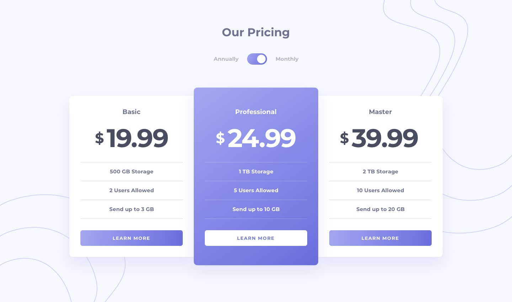

# Pricing component with toggle solution - Frontend Mentor 

This is a solution to the [Pricing component with toggle challenge on Frontend Mentor](https://www.frontendmentor.io/challenges/pricing-component-with-toggle-8vPwRMIC). Frontend Mentor challenges help you improve your coding skills by building realistic projects. 

## Table of contents

- [Overview](#overview)
- [The challenge](#the-challenge)
- [Screenshot](#screenshot)
- [Links](#links)
- [Built with](#built-with)
- [Author](#author)

## Overview

Your challenge is to build out this pricing component and get it looking as close to the design as possible. This challenge will get you thinking about building an accessible custom toggle control and also test your layout skills.

### The challenge

Users should be able to:

- View the optimal layout for the component depending on their device's screen size
- Control the toggle with both their mouse/trackpad and their keyboard
- **Bonus**: Complete the challenge with just HTML and CSS

### Screenshot

### Links

- Solution URL: [Solution URL](https://github.com/rudyjm3/pricing-component-with-toggle)
- Live Site URL: [Live site URL](https://pricing-component-with-toggle-fem.netlify.app/)

### Built with

- Semantic HTML5 markup
- SCSS
- Flexbox
- Javascript

### Author

- Rudolph Mims (Rudy)
- [Linkedin](https://www.linkedin.com/in/rudolph-mims-42802662/)